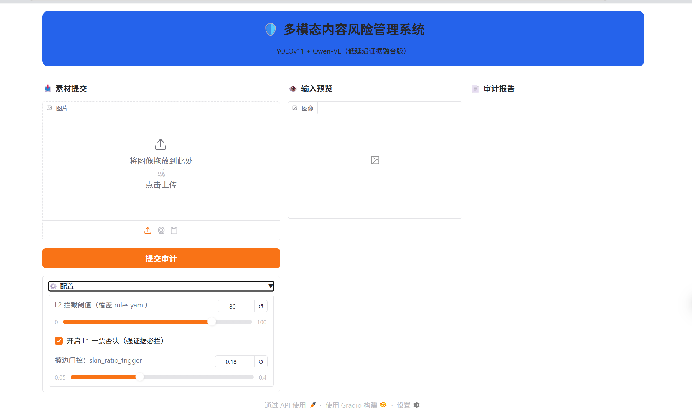
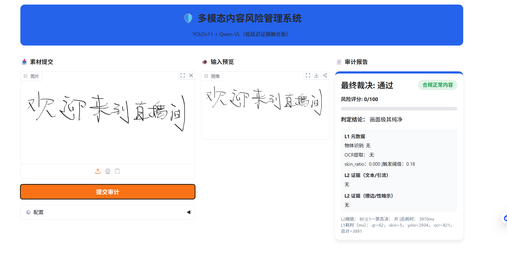
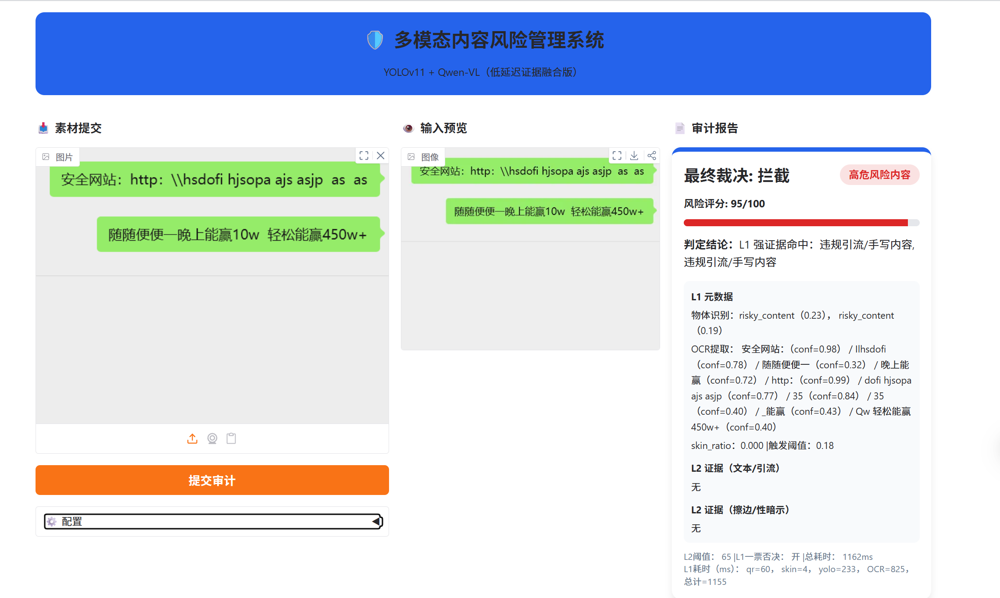

# 多模态内容风控系统（直播 / 图片）

一个可运行的多模态内容风控 Demo 系统，  
将 **视觉检测、OCR、语义审计与策略引擎** 解耦为 **L1 / L2 / L3 多层决策链路**，  
在保证 **低延迟实时审计** 的同时，输出 **可解释的风险证据与裁决结果**，  
用于模拟直播 / 图片场景下的违规引流、手写文本与高风险内容拦截。

## 📸 Demo 演示（Web UI）
以下为真实风控链路演示：同一套系统可区分「合规内容 / 引流违规 / 强证据拦截」，并输出可解释的审核证据与耗时信息。
以下截图展示了系统在不同场景下的实际运行效果：

### 1️⃣ 系统初始界面
> 提供图片上传与参数配置入口，用于模拟直播/图片内容审核流程



---

### 2️⃣ 合规内容（通过）
> 普通文本/手写内容，无违规要素，系统判定为 **通过**



---

### 3️⃣ 违规内容（拦截）
> 命中违规引流/手写内容，触发 **L1 强证据拦截**，并给出风险评分与证据说明




### 🚀 本地运行 Demo

```bash
pip install -r requirements.txt
python app/app.py

启动后访问 Web UI：
http://127.0.0.1:7860


---

## 能做什么

- 识别 **二维码 / 联系方式 / 引流文字**
- 识别 **擦边 / x暗示画面**
- 尽量减少普通直播话术的误报
- 输出清晰的审核结果和命中证据

---

## 整体流程（通俗版）

1. **第一步：快速检查**
   - 目标检测（YOLO）
   - 二维码快速识别
   - OCR 提取画面文字
   - 简单肤色比例判断（用于是否需要进一步检查）

2. **第二步：必要时再深入判断**
   - 当画面或文字“有点可疑”时，才会触发多模态模型进行兜底判断

3. **第三步：给出最终结论**
   - 通过 / 拦截
   - 风险评分
   - 命中的证据说明

---

## 项目结构

.
├── app/ # 启动入口（Gradio 界面）
├── core/
│ ├── l1_shield/ # 快速检测（YOLO / OCR / QR / skin_ratio）
│ ├── l2_brain/ # 多模态兜底判断
│ └── l3_policy/ # 规则融合与最终裁决
├── configs/ # 规则与配置（rules.yaml）
├── models/ # 模型权重（不随仓库提供）
├── data/ # 示例 / 测试数据
├── experiments/ # 训练与实验代码（不影响运行）
└── requirements.txt

yaml
复制代码

---

## 环境准备

### 1）安装依赖

```bash
pip install -r requirements.txt
2）准备模型文件（必须）
本仓库 不包含模型权重文件，请自行准备并放入：

bash
复制代码
models/
├── best.pt        # 你的微调 YOLO 权重
└── yolo11s.pt     # 官方 YOLO 权重（回退用，可选）
3）可选：多模态审核（需要 API Key）
如果你希望启用多模态兜底判断，请创建 .env 文件：

env
复制代码
DASHSCOPE_API_KEY=你的key
DASHSCOPE_BASE_URL=https://dashscope.aliyuncs.com/compatible-mode/v1
如果不配置，也可以正常运行，只是不会触发多模态判断。

启动方式
请在 项目根目录 执行：

bash
复制代码
python -m app.app
启动后，浏览器会自动打开：

cpp
复制代码
http://127.0.0.1:7860
使用说明
上传一张图片（直播截图 / 图片素材）

点击「提交审计」

查看右侧生成的审核报告，包括：

最终裁决（通过 / 拦截）

风险评分

命中的证据

各阶段耗时信息

配置说明
configs/rules.yaml
用于配置不同风险类型的拦截阈值与策略
修改规则 不需要改代码

说明
本项目主要用于学习、实验和工程展示。
如需用于真实业务场景，请根据实际平台规范与法律要求进行调整。